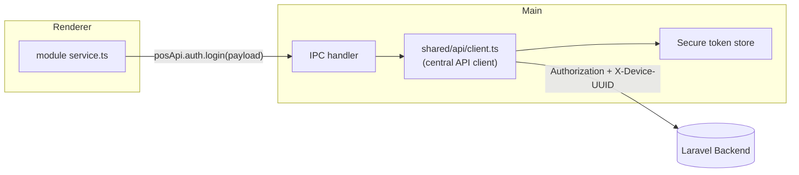
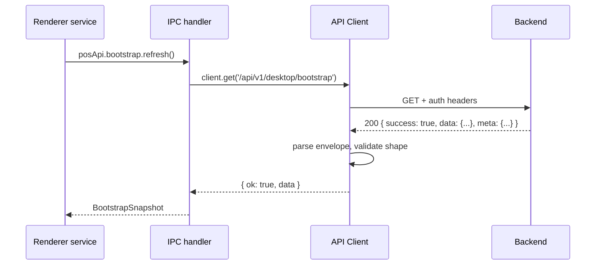
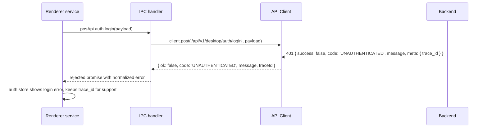

# API Integration Architecture

Rules: [.ai/guidelines/backend-api-contract.md](../../.ai/guidelines/backend-api-contract.md).
Not implemented yet — target design for Phase 2+.

## Where the API Client Lives

The central API client runs in the **main process** (not the renderer) — it needs to attach the
securely-stored desktop token and device UUID without ever handing them to the renderer, and it
needs to keep working (queuing/retrying) independent of any window being open.

Renderer-side "services" (per `.ai/guidelines/vue-structure.md`) call `window.posApi`, which
already resolves to parsed, envelope-checked, error-normalized data — they are thin wrappers, not
where HTTP happens.

## Client Responsibilities

1. Attach `Authorization: Bearer <desktop_token>` + `X-Device-UUID: <device_uuid>` to every
   protected request; skip for the two public endpoints
   (`device/register`, `auth/login`).
2. Parse every response against the success/error envelope
   (`docs/backend-contract/response-envelope.md`).
3. Normalize errors to `{ code, message, errors?, traceId? }` for IPC handlers to return.
4. Restrict all calls to `/api/v1/desktop/*` — never `/api/v1/admin/*`.

## Request Flow (example: bootstrap fetch)

On error:

## OpenAPI Adoption Path

Once the desktop OpenAPI spec is imported into this repo (location TBD — likely
`docs/backend-contract/openapi/` or a generated-types package), request/response TypeScript types
should be generated from it rather than hand-maintained, to avoid drift from the backend's actual
contract. Until then, hand-written types in this repo are marked `TODO: confirm against OpenAPI`
wherever the exact shape isn't given directly in
[docs/backend-contract/](../backend-contract/desktop-api-summary.md).
