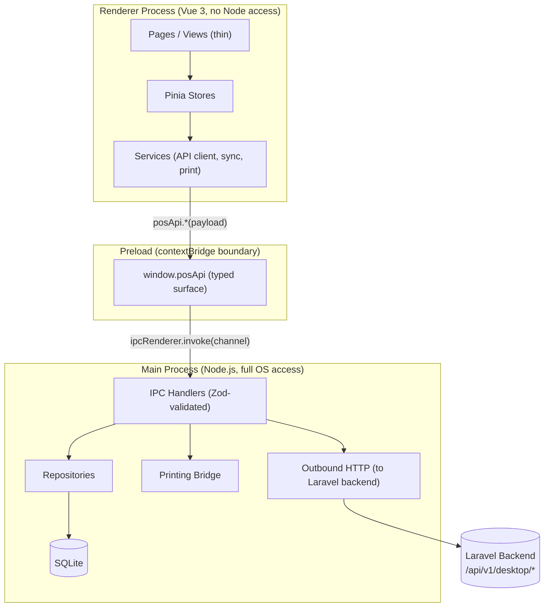
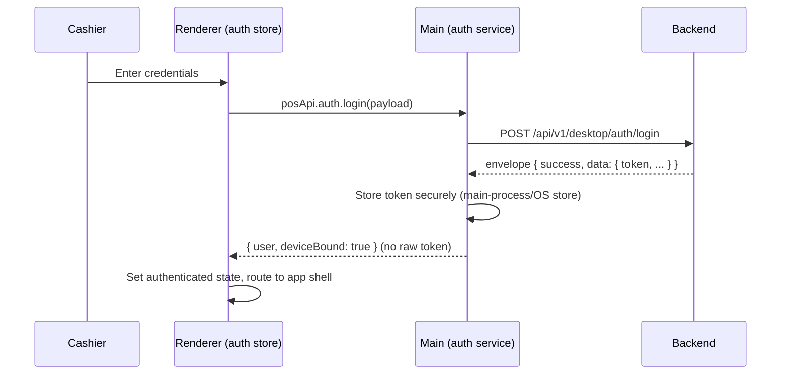
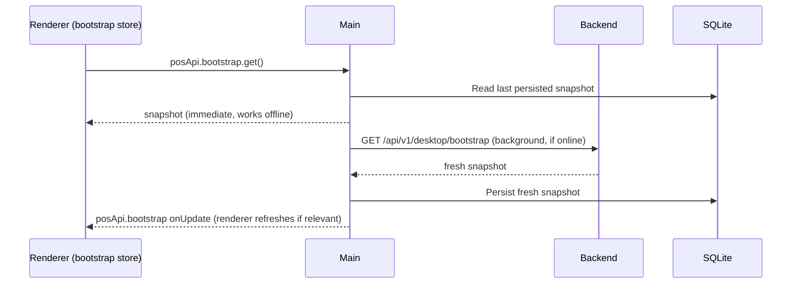
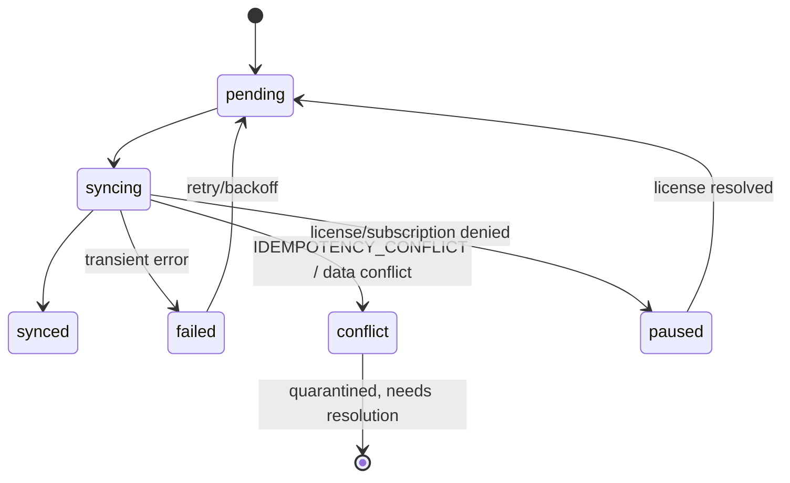

# Desktop Frontend Architecture

## Overview

`pos-desktop` is an Electron application with three isolated process contexts (main, preload,
renderer) around a Vue 3 SPA. It is designed to work fully offline against a local SQLite
database, syncing to the Laravel backend opportunistically. Full rule set:
[.ai/guidelines/desktop-architecture.md](../../.ai/guidelines/desktop-architecture.md).

## Process Diagram



## Responsibilities

| Process | Owns | Never does |
|---|---|---|
| Main | SQLite, migrations, repositories, printing, device identity, secure token storage, outbound HTTP to backend | Render UI |
| Preload | Narrow typed bridge (`window.posApi`) | Business logic, SQL, HTTP calls itself |
| Renderer | UI, Pinia state, routing, presentation logic | Node access, SQLite, filesystem, raw IPC |

## Data Flow (Read)

```txt
Vue page -> Pinia store -> service -> window.posApi.X() -> IPC -> repository -> SQLite -> (reverse)
```

For data that may also come from the backend (e.g. bootstrap catalog refresh), the service layer
decides local-vs-remote based on connectivity/staleness — the page never knows the difference.

## Auth Flow (target — Phase 2)



Device registration (`POST /api/v1/desktop/device/register`) precedes login on a fresh install and
follows the same pattern — see
[backend-contract/auth-device-contract.md](../backend-contract/auth-device-contract.md).

## Bootstrap Flow (target — Phase 2)



## Sync Flow (target — Phase 4)



Full state/ordering rules:
[offline-sync-architecture.md](offline-sync-architecture.md) and
[.ai/guidelines/offline-sync-contract.md](../../.ai/guidelines/offline-sync-contract.md).

## Current vs. Target

The diagrams above describe the **target** architecture. As of Phase 0, only the Electron
main/preload/renderer scaffold exists (`src/main/index.ts`, `src/preload/index.ts`,
`src/renderer/src/App.vue`) with no modules, stores, database, or API client yet. See
[../phases/01-foundation-structure.md](../phases/01-foundation-structure.md) for what Phase 1
actually builds.
