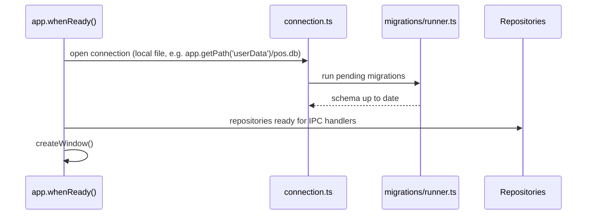

# Local Database Architecture

Rules: [.ai/guidelines/local-database.md](../../.ai/guidelines/local-database.md). Phase 1 provides
the connection owner, ordered migrator, and `0001_foundation` metadata/queue schema; sales and
catalog entity tables remain later-phase work.

## Location

```txt
src/main/database/
├── connection.ts        # opens/owns the single SQLite connection
├── migrator.ts           # applies ordered migrations in a transaction
├── migrations/0001_foundation.ts
└── ../repositories/      # typed settings, identity, metadata, secret and queue repositories
```

## Startup Sequence



The database file lives under Electron's `app.getPath('userData')`, not inside the app bundle
(bundle is read-only once packaged, and userData is per-installation).

## Entity Shape (syncable entities)

Every syncable table includes, at minimum:

```sql
local_uuid      TEXT PRIMARY KEY,
remote_uuid     TEXT NULL,
sync_status     TEXT NOT NULL DEFAULT 'pending', -- pending|uploading|synced|retryable_error|conflict|rejected
sync_attempts   INTEGER NOT NULL DEFAULT 0,
last_sync_error TEXT NULL,
created_at      TEXT NOT NULL,
updated_at      TEXT NOT NULL,
deleted_at      TEXT NULL -- tombstone, set instead of hard delete once synced
```

## Repository Pattern

Each repository exposes typed methods (`create`, `findByLocalUuid`, `markSynced`,
`listPendingSync`, etc.) and is the only module writing SQL for its entity. IPC handlers call
repositories; repositories never call each other's private SQL — cross-entity operations
(e.g. "complete sale" writing a sale + decrementing local stock) go through a main-process service
that calls multiple repositories inside a single SQLite transaction.

## Migration Runner

- Migrations are ordered, numbered, and immutable once merged — a schema change ships as a new
  migration file, never an edit to an existing one.
- The runner tracks applied migrations (a `schema_migrations` table) so the app can upgrade an
  existing installation's local database safely across app versions.

## Relationship to Sync

See [offline-sync-architecture.md](offline-sync-architecture.md) — the `sync_status` field and the
sync-queue repository are what the sync service reads/writes to drive the state machine described
there. The database layer itself has no network awareness; it only tracks state.
