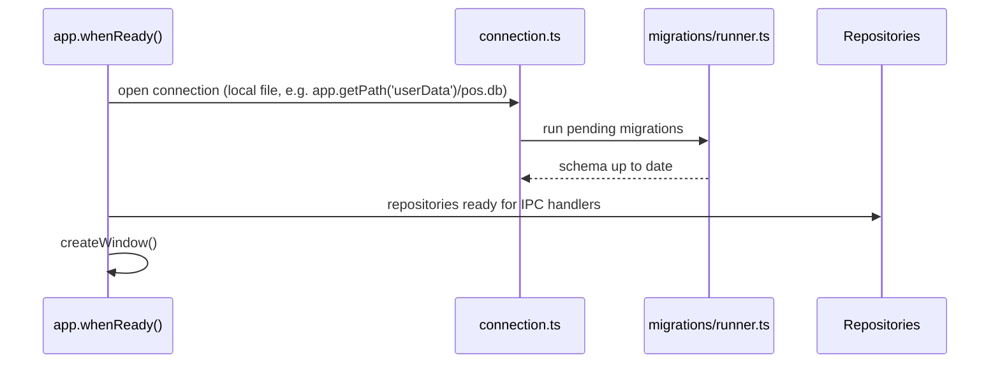

# Local Database Architecture

Rules: [.ai/guidelines/local-database.md](../../.ai/guidelines/local-database.md). Phase 1 provides
the connection owner, ordered migrator, and `0001_foundation` metadata/queue schema; sales and
catalog entity tables remain later-phase work.

## Location

```txt
src/main/database/
├── connection.ts        # opens/owns the single SQLite connection
├── migrator.ts           # applies ordered migrations in a transaction
├── migrations/0001_foundation.ts
└── ../repositories/      # typed settings, identity, metadata, secret and queue repositories
```

## Startup Sequence



The database file lives under Electron's `app.getPath('userData')`, not inside the app bundle
(bundle is read-only once packaged, and userData is per-installation).

## Entity Shape (syncable entities)

Every syncable table includes, at minimum:

```sql
local_uuid      TEXT PRIMARY KEY,
remote_uuid     TEXT NULL,
sync_status     TEXT NOT NULL DEFAULT 'pending', -- pending|uploading|synced|retryable_error|conflict|rejected
sync_attempts   INTEGER NOT NULL DEFAULT 0,
last_sync_error TEXT NULL,
created_at      TEXT NOT NULL,
updated_at      TEXT NOT NULL,
deleted_at      TEXT NULL -- tombstone, set instead of hard delete once synced
```

## Repository Pattern

Each repository exposes typed methods (`create`, `findByLocalUuid`, `markSynced`,
`listPendingSync`, etc.) and is the only module writing SQL for its entity. IPC handlers call
repositories; repositories never call each other's private SQL — cross-entity operations
(e.g. "complete sale" writing a sale + decrementing local stock) go through a main-process service
that calls multiple repositories inside a single SQLite transaction.

## Migration Runner

- Migrations are ordered, numbered, and immutable once merged — a schema change ships as a new
  migration file, never an edit to an existing one.
- The runner tracks applied migrations (a `schema_migrations` table) so the app can upgrade an
  existing installation's local database safely across app versions.

## Relationship to Sync

See [offline-sync-architecture.md](offline-sync-architecture.md) — the `sync_status` field and the
sync-queue repository are what the sync service reads/writes to drive the state machine described
there. The database layer itself has no network awareness; it only tracks state.


## Allocation Lifecycle and Reconciliation (BH-04B-3)

Migration `0009_allocation_lifecycle_reconciliation` rebuilds `stock_allocation_grants` — SQLite has
no `ALTER TABLE ... DROP CONSTRAINT`, so changing a `CHECK` requires a create/copy/drop/rename
rebuild. The two prior constraints encoded assumptions about how the *backend* moves an allocation
between lifecycle states (e.g. requiring `sealed_at IS NULL` whenever the legacy `status` column read
`'active'`); they are replaced by one rule constraining only this app's own legacy-status mirror to
agree with the authoritative `server_status` column. See the migration file's own doc comment for the
full defect history.

**Rebuilding a table with foreign-key children.** [BH-04B-3-R1 correction: an earlier version of
this section claimed SQLite always refuses `DROP TABLE` of an FK-referenced parent "regardless of
`defer_foreign_keys`." That was too broad and has been replaced below with the precise, confirmed
behavior; the migrator's implementation was already correct and needed no change — only the
explanation of *why* did.]
SQLite's `DROP TABLE` performs an implicit `DELETE FROM` on the table first
(sqlite.org/foreignkeys.html §5). For a plain (non-`DEFERRABLE`) foreign key — this schema's default
— that implicit delete's constraint violation is checked immediately, so a bare `DROP TABLE` of an
FK-referenced parent fails right away. Setting `PRAGMA defer_foreign_keys = ON` for the transaction
changes that: confirmed directly against a minimal repro, `DROP TABLE` then **succeeds** (the
violation is deferred rather than refused). But it is still not usable for a create/copy/drop/rename
table rebuild: after renaming a fully-populated replacement table back into the original name —
`PRAGMA foreign_key_check` reporting zero violations at that point, mid-transaction — `COMMIT` still
fails with the same `FOREIGN KEY constraint failed` error. The deferred-violation state recorded
during the implicit delete is not reconciled by the later rename, even though the data is by then
fully self-consistent by any real measure. `PRAGMA foreign_keys = OFF` is also a documented no-op
once a transaction is already open (confirmed: the pragma's own read-back value stays `1`/ON), so it
must be disabled *before* the transaction begins.

This is exactly SQLite's own recommended procedure for this category of schema change
(sqlite.org/lang_altertable.html §8, "Making Other Kinds Of Table Schema Changes"): disable
`foreign_keys`, start the transaction, rebuild, run `PRAGMA foreign_key_check` before commit, commit,
then re-enable `foreign_keys`. `DatabaseMigration` carries an opt-in
`rebuildsForeignKeyReferencedTable` flag implementing precisely that sequence: when set,
`runMigrations()` disables `foreign_keys` strictly *before* opening that migration's transaction and
restores it strictly *after*, in a `finally`. The migration itself remains the actual safety gate: it
must run its own `PRAGMA foreign_key_check` before returning and throw if it finds anything, so a
genuine orphaned row still rolls back that migration's transaction rather than committing a damaged
schema silently — proven with a dedicated regression that deliberately loses a row during a toy
rebuild and confirms the gate refuses it (`allocationLifecycleMigration.suite.ts`), not merely with a
rebuild that has never actually found anything wrong.

**Reconciliation tables** (also added by migration 0009):

- `stock_allocation_coverage_boundaries` — the accepted BH-04A §3.1 coverage boundary per
  `(allocation_uuid, rights_generation)`. No foreign key to `stock_allocation_grants`: an
  invoice-upload response can report coverage for an allocation the current bootstrap snapshot no
  longer lists.
- `stock_allocation_terminal_markers` — permanent terminal evidence, keyed by `allocation_uuid` alone.
  Also no foreign key, deliberately: a marker must be retained even when its allocation is absent
  locally, so a later stale envelope can never reintroduce spendable rights for a terminal identity.
- `stock_allocation_holds` — durable deny-spend state, written whenever observed coverage or terminal
  evidence is missing, inconsistent, or impossible. Cleared only by a subsequent write that actually
  re-verifies the boundary against local evidence — never by a retry, a fallback, or an error handler.

`local_stock_allocation_consumptions` gained the journal-v1 entry fields
(`rights_generation`, `invoice_idempotency_key`, `item_line_uuid`, `request_hash`, `entry_hash`,
`chain_hash`), pinned at insert time rather than looked up later, so a bootstrap arriving between
commit and upload can never change the identity a consumption was authored against. Historical rows
whose frozen upload payload could not be recovered keep these columns `NULL` and their grant is
recorded in `stock_allocation_holds` — evidence is never invented and rows are never deleted to make
a coverage boundary validate.

`src/main/services/allocationJournal.ts` and `src/main/services/invoiceRequestHash.ts` reimplement
the backend's journal-v1 byte framing and `desktop_invoice_syncs.request_hash` computation exactly,
proven against backend-generated cross-language golden vectors committed to both repos
(`tests/fixtures/stock-allocation-journal-v1.json`,
`tests/fixtures/desktop-invoice-request-hash-golden.json`). `src/main/services/allocationReconciliation.service.ts`
implements the §3.1 boundary predicate and terminal-marker application; it holds no transaction of
its own; every caller applies it inside the transaction that also commits the rest of that response.

**Write serialization.** `src/main/database/serializedWrite.ts` opens the checkout and reconciliation
write transactions with `BEGIN IMMEDIATE` rather than better-sqlite3's default `BEGIN DEFERRED`, and
retries only when the transaction itself could not begin — never when contention is raised from
inside an already-entered closure, which propagates as the existing storage-failure path instead.

## Allocation Recovery (BH-04B-4)

Migration `0010_allocation_recovery` is additive. It does not rebuild
`stock_allocation_holds`: migration 0009 applies no database `CHECK` to that table's `reason`, so the
new protocol does not require changing its DDL. Existing holds, ownership, keys and indexes remain
untouched.

`stock_allocation_recoveries` stores the durable, generation-bound no-more-sales boundary. Its state
moves monotonically through `intent`, `sealed`, `acknowledged`, then `terminal` (or fail-closed
`conflict`). Checkout selection and final spendability both exclude any generation with a recovery
row. That exclusion is independent of `stock_allocation_holds`, so bootstrap, top-up, upload coverage,
ordinary conflict repair and worker retries cannot reactivate a generation by clearing a different
reason for denial.

`stock_allocation_recovery_dependencies` freezes every invoice represented in the declared journal,
including invoices already marked synced when authoritative local coverage is missing. Resolution
requires matching server-persisted identity and a coverage boundary that includes the exact entry;
sync status alone is never evidence. Immediately before acknowledgement, the repository rebuilds and
validates the complete dependency predicate inside the serialized local transaction.

Recovery network calls occur only outside SQLite transactions. Intent commits before the seal HTTP
request; the returned seal identity, recomputed complete journal and dependency set commit together;
invoice replay uses the existing immutable queue payload and idempotency identity; and a lost
acknowledgement response resumes with the same frozen proof/key. Current commercial access and
permission are rechecked for every dispatch. Terminal-marker ingestion advances recovery without
making the old allocation selectable.
