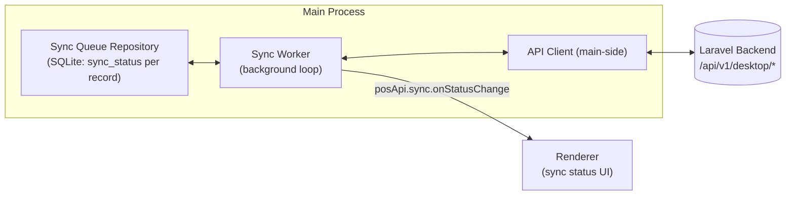
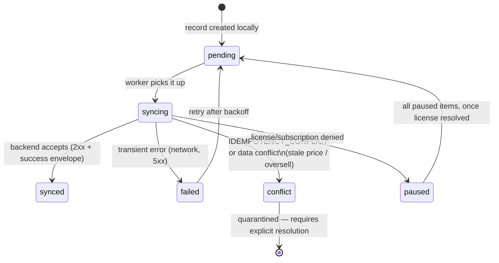

# Offline Sync Architecture

Rules: [.ai/guidelines/offline-sync-contract.md](../../.ai/guidelines/offline-sync-contract.md).
Not implemented yet — target design for Phase 4, described here so Phase 1-3 code (schema, API
client) is built compatible with it.

## Components (target)

The sync worker runs in the main process (it needs SQLite + network + to survive independent of
any single renderer window state) and pushes status updates to the renderer via an IPC event, not
polling from the renderer side.

## State Machine

`conflict` and `paused` are terminal-until-human-or-external-resolution states — the worker does
not silently retry out of them.

## Ordering Rules

- The worker processes `pending` items respecting dependency order: a refund with an unsynced
  parent invoice stays `pending` (skipped, not `failed`) until the invoice reaches `synced`.
- Idempotency keys are assigned at record-creation time (in the repository, not the worker), so a
  retry after a lost response reuses the same key safely.

## Quarantine Handling

`conflict` items are surfaced in a dedicated UI (sync/queue screen) with enough detail (local
payload, backend-reported reason/code) for a human decision — the worker never guesses a
resolution. This keeps financial data (a completed sale, a refund) from ever being silently
dropped or silently overwritten.

## License-Denial Pause

A `FEATURE_NOT_ENABLED`, license-invalid, or subscription-denied response on any sync attempt
pauses the **entire** queue (`paused`), not just the one item — the worker stops attempting further
syncs until a license re-check succeeds, at which point all `paused` items return to `pending`.

## Renderer Visibility

The renderer never talks to the backend directly for sync — it only observes state via
`window.posApi.sync.getStatus()` / `onStatusChange`, per
[.ai/guidelines/ipc-contracts.md](../../.ai/guidelines/ipc-contracts.md), and renders the
offline/sync indicators described in
[.ai/guidelines/pos-ux-rules.md](../../.ai/guidelines/pos-ux-rules.md).
