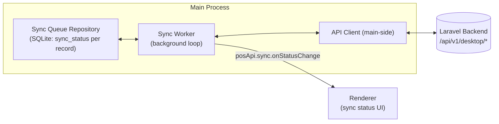
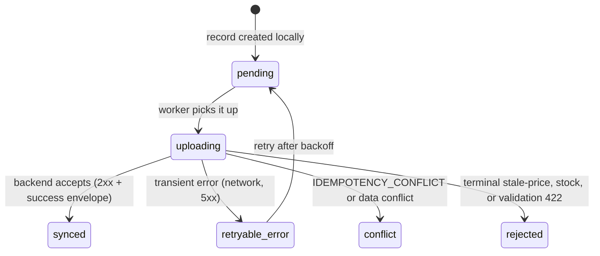

# Offline Sync Architecture

Rules: [.ai/guidelines/offline-sync-contract.md](../../.ai/guidelines/offline-sync-contract.md).
Not implemented yet — target design for Phase 4, described here so Phase 1-3 code (schema, API
client) is built compatible with it.

## Components (target)

```mermaid
flowchart LR
    subgraph Main Process
        Queue["Sync Queue Repository\n(SQLite: sync_status per record)"]
        Worker["Sync Worker\n(background loop)"]
        Client["API Client (main-side)"]
    end
    Backend[("Laravel Backend\n/api/v1/desktop/*")]
    Renderer["Renderer\n(sync status UI)"]

    Queue <--> Worker
    Worker <--> Client
    Client <--> Backend
    Worker -->|"posApi.sync.onStatusChange"| Renderer
```

The sync worker runs in the main process (it needs SQLite + network + to survive independent of
any single renderer window state) and pushes status updates to the renderer via an IPC event, not
polling from the renderer side.

## State Machine

```mermaid
stateDiagram-v2
    [*] --> pending: record created locally
    pending --> uploading: worker picks it up
    uploading --> synced: backend accepts (2xx + success envelope)
    uploading --> retryable_error: transient error (network, 5xx)
    retryable_error --> pending: retry after backoff
    uploading --> conflict: IDEMPOTENCY_CONFLICT or data conflict
    uploading --> rejected: terminal stale-price, stock, or validation 422
```

`conflict` and `rejected` are terminal persisted states — the worker does not silently retry them.
License or token denial pauses the worker operationally without adding a persisted per-item state.

## Ordering Rules

- The worker processes `pending` items respecting dependency order: a refund with an unsynced
  parent invoice stays `pending` (skipped, not `retryable_error`) until the invoice reaches `synced`.
- Idempotency keys are assigned at record-creation time (in the repository, not the worker), so a
  retry after a lost response reuses the same key safely.

## Sale attempts and allocation dispatch evidence

A sale attempt (`sale_attempts`) exists _before_ a queue item: it is the durable claim made when
the cashier completes payment. It holds one attempt per owner (company, device, user); while it is
`claimed`, every other sale for that owner is refused with `attempt-blocked`. An attempt is only
released on evidence, never on a timer:

| Situation                                                                                | Result                                                                                                                                                                               |
| ---------------------------------------------------------------------------------------- | ------------------------------------------------------------------------------------------------------------------------------------------------------------------------------------ |
| Catalog superseded (revision changed or catalog no longer valid)                         | Terminal `rejected` with `catalog-superseded`, inside the serialized business transaction, before any write. It can never commit: revisions and the trusted clock only move forward. |
| Offline allocation cannot cover the sale                                                 | Terminal `rejected` with `stock-allocation-unavailable`.                                                                                                                             |
| Refreshable local state (shift, permission, workstation, allocation data)                | Stays `claimed`; retry after the fix.                                                                                                                                                |
| Top-up refused after the server's idempotency lookup (`STOCK_ALLOCATION_DEMAND_REFUSED`) | Stays `claimed` (`allocation-refused`); retry re-sends the same key and bytes.                                                                                                       |
| Top-up outcome unknown (transport, 5xx, 429/503)                                         | Stays `claimed` (`allocation-acquisition-unresolved`); retry re-sends the recorded bytes.                                                                                            |
| The server holds this key with different bytes, or the bytes are invalid                 | Stays `claimed` (`allocation-integrity-blocked`); Retry is hidden, and the support reference is kept.                                                                                |
| Explicit Cancel by the cashier                                                           | `abandoned`, after main re-reads the witnesses (no invoice for the attempt). Recorded requests are never discarded.                                                                  |

Every top-up request is recorded in `attempt_allocation_dispatches` _before_ it is sent, with its
exact bytes. The row is resolved only by a server answer: `granted`, `refused`, `conflict` or
`invalid`. Rows are never deleted. A main-owned `AllocationDispatchReconciler` re-sends outstanding
rows for the current owner when the app is online. It never mints a key and never touches an
invoice or queue row, so a request whose response was lost is resolved exactly once, even after
the sale committed offline.

Attempts claimed by a build older than this evidence (`dispatch_evidence = 'unknown'`) cannot prove
what was sent. Cancelling one requires an explicit acknowledgement. It records an append-only
`legacy_dispatch_uncertainties` row, which is never closed automatically. A reservation that
appears later is handled by the normal grant lifecycle and is not claimed to be related.

Grant ingest is exactly-once. At an equal allocation revision, lifecycle fields must be identical,
and consumption may only advance. It is validated against a persisted high-water mark
(`stock_allocation_validation_marks`), because non-final consumption writes no lifecycle audit on
the server.

## Conflict and Rejection Handling

`conflict` items are surfaced in a dedicated UI (sync/queue screen) with enough detail (local
payload, backend-reported reason/code) for a human decision — the worker never guesses a
resolution. This keeps financial data (a completed sale, a refund) from ever being silently
dropped or silently overwritten.

Stale-price and oversell responses are terminal `rejected` records after a 422 response. Preserve
the immutable local payload and guide staff to refresh data, reconcile the sale or inventory, and
create a corrective follow-up rather than editing the original queue item.

## Quarantine and operator disposition (PS6b)

A physical-presence upload whose allocation proof the server refuses is `rejected` with
`DESKTOP_INVOICE_QUARANTINED` and one quarantine reason. It is never resent. An operator decides it on
the server; `InvoiceDispositionConvergenceService` (main) discovers the decision with a pure read of
`GET /invoices/sync-status` at startup and on each access publish (at most once a minute, at most once
per sale every two minutes, gated like the upload worker), and `InvoiceDispositionDiscoveryService`
verifies it against the frozen payload and applies it in one `runSerializedWrite` transaction:

- `accept_without_proof` → the one queue row and its invoice `rejected → synced`, under the server's
  invoice UUID and number; `reject_permanently` → both stay `rejected`.
- Both install `stock_allocation_disposition_holds` (no clearing path), which deny spend on the held
  identity and release dependent uploads into their own attempt.
- `local_stock_allocation_consumptions` is never touched; accepted rows are acknowledged only by
  ordinary verified coverage.
- A result that does not verify becomes a durable `invoice_disposition_conflicts` row and the sale is
  never asked about again.

## License-Denial Pause

A `FEATURE_NOT_ENABLED`, license-invalid, or subscription-denied response on any sync attempt
pauses the **worker**, not just the one item — the worker stops attempting further syncs until a
license re-check succeeds. Existing queue records retain their persisted state.

## Renderer Visibility

The Sync page's "Needs attention" section reads the same durable records through one owner-scoped
channel, `sync:support-issues` (company + device from the session; another cashier's rows carry no
transaction details). It separates integrity issues that need support (`conflict`/`invalid`
dispatch rows, open legacy uncertainties), requests still being confirmed automatically
(`dispatched` rows), and a payment still waiting on the POS screen. It offers no retry,
acknowledge or delete action, and it re-reads when the reconciler resolves a request
(`onRequestsResolved` → the sanitized sync status push).

The renderer never talks to the backend directly for sync — it only observes state via
`window.posApi.sync.getStatus()` / `onStatusChange`, per
[.ai/guidelines/ipc-contracts.md](../../.ai/guidelines/ipc-contracts.md), and renders the
offline/sync indicators described in
[.ai/guidelines/pos-ux-rules.md](../../.ai/guidelines/pos-ux-rules.md).
