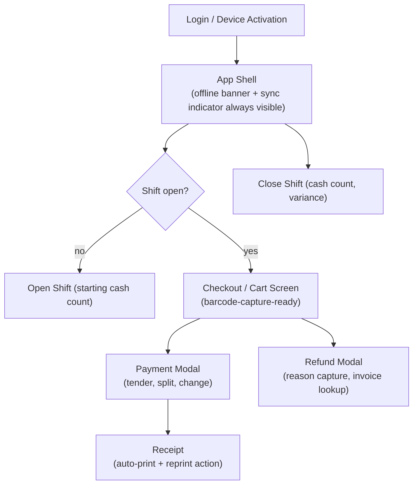

# POS UX Architecture

Rules: [.ai/guidelines/pos-ux-rules.md](../../.ai/guidelines/pos-ux-rules.md). This doc describes
how the UX rules map to concrete UI structure (target — Phases 3-5).

## Screen Map (target)

## Barcode-First Input

The checkout screen keeps a global key listener active (via `useBarcodeScanner()`) so a scan works
regardless of which element has focus, distinguishing fast scanner input (many keystrokes within a
short window, terminated by Enter) from normal typing. A manual product-search field exists as a
fallback, not as the primary input method.

## Always-Visible System State

The app shell (not each individual page) renders:

- **Offline banner** — connectivity/backend-reachability state.
- **Sync indicator** — pending count / uploading / worker paused (+ reason).
- **License/grace warning** — shown when the backend reports a non-normal license state.

These are shell-level components so no individual page can accidentally omit them.

## Modal Flow Pattern

Payment, refund, and shift-close each use one focused modal component with an internal step
state (not a route change), so cancel/back is always unambiguous and partial input is discarded
cleanly on cancel rather than leaking into the underlying screen's state.

## Receipt Handling

Completing a sale triggers `window.posApi.print.receipt(payload)` (see
[secure-preload-ipc.md](secure-preload-ipc.md)); the sale is recorded as complete in local SQLite
*before* the print call, so a printer failure never contradicts the recorded sale. A reprint action
on any historical sale calls the same bridge method with the stored receipt payload.
