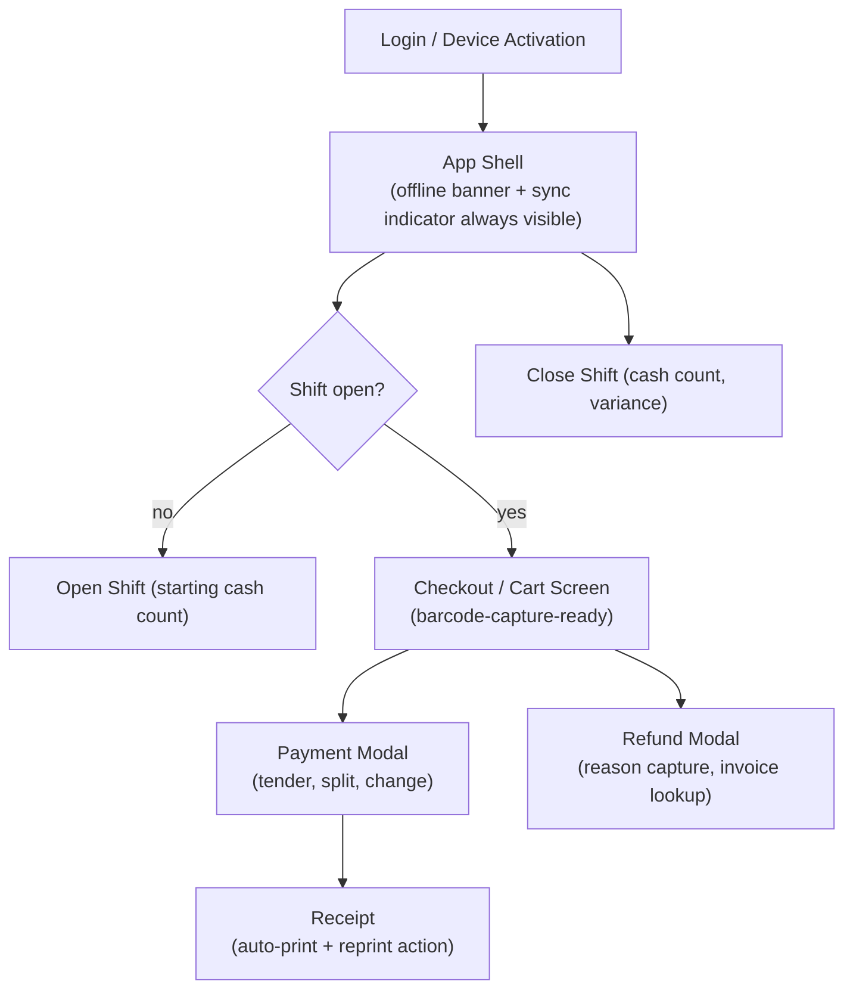

# POS UX Architecture

Rules: [.ai/guidelines/pos-ux-rules.md](../../.ai/guidelines/pos-ux-rules.md). This doc describes
how the UX rules map to concrete UI structure (target — Phases 3-5).

## Screen Map (target)

```mermaid
flowchart TB
    Login["Login / Device Activation"] --> Shell["App Shell\n(offline banner + sync indicator always visible)"]
    Shell --> ShiftGate{"Shift open?"}
    ShiftGate -- no --> OpenShift["Open Shift (starting cash count)"]
    ShiftGate -- yes --> Checkout["Checkout / Cart Screen\n(barcode-capture-ready)"]
    Checkout --> Payment["Payment Modal\n(tender, split, change)"]
    Payment --> Receipt["Receipt\n(auto-print + reprint action)"]
    Checkout --> Refund["Refund Modal\n(reason capture, invoice lookup)"]
    Shell --> CloseShift["Close Shift (cash count, variance)"]
```

## Barcode-First Input

The checkout screen keeps a global key listener active (via `useBarcodeScanner()`) so a scan works
regardless of which element has focus, distinguishing fast scanner input (many keystrokes within a
short window, terminated by Enter) from normal typing. A manual product-search field exists as a
fallback, not as the primary input method.

## Always-Visible System State

The app shell (not each individual page) renders:

- **Offline banner** — connectivity/backend-reachability state.
- **Sync indicator** — pending count / uploading / worker paused (+ reason).
- **License/grace warning** — shown when the backend reports a non-normal license state.

These are shell-level components so no individual page can accidentally omit them.

## Modal Flow Pattern

Payment, refund, and shift-close each use one focused modal component with an internal step
state (not a route change), so cancel/back is always unambiguous and partial input is discarded
cleanly on cancel rather than leaking into the underlying screen's state.

## Receipt Handling

Completing a sale triggers `window.posApi.print.receipt(payload)` (see
[secure-preload-ipc.md](secure-preload-ipc.md)); the sale is recorded as complete in local SQLite
*before* the print call, so a printer failure never contradicts the recorded sale. A reprint action
on any historical sale calls the same bridge method with the stored receipt payload.

## Scanner and payment keyboard model

One window-level, capture-phase keydown/keyup router —
[`modules/pos/scanInputRouter.ts`](../../src/renderer/src/modules/pos/scanInputRouter.ts),
mounted by the POS page through `useScanInputRouter()` — owns scanner input and the payment
dialog's keyboard path. It replaces a separately mounted `useBarcodeScanner()` on the page (its
page mode reuses the same detector), so the page must not mount both.

### Supported scanners

- **HID keyboard-wedge** scanners only: the scanner types its payload as ordinary key events.
- **Payload:** printable characters. A Space inside the payload is supported; a leading Space is
  not (it is indistinguishable from a person pressing Space on a focused control).
- **Suffix:** Enter (including NumpadEnter), Tab, or none.
- **Not supported:** a prefix, function keys, or Ctrl/Alt/Meta combinations in the scanner program.
- The scanner must emit a Latin keyboard layout; letters typed through a non-Latin OS layout arrive
  as that layout's characters.

### Modes

The page reports one mode per key event (`options.mode()`); any mode change discards partial
input.

| Mode             | When                                         | Scanner handling                                                                                                                                               |
| ---------------- | -------------------------------------------- | -------------------------------------------------------------------------------------------------------------------------------------------------------------- |
| `page`           | checkout page, no payment dialog             | Timing-based detector (≤ 35 ms gaps, Enter/Tab suffix or 60 ms completion), ordered serialized `onScan`. Paused while any `[aria-modal="true"]` is open.       |
| `payment-tender` | payment dialog, tender step                  | Printable keys on controls are swallowed; the terminator reports `onScannerIgnored`. Fields type natively (best-effort burst revert below).                    |
| `payment-done`   | committed sale awaiting "New sale"           | Explicit collection (non-space printable starts it), Enter/Tab ends it → `onDoneCode` (ordered, serialized); shorter than 3 → dropped with `onScannerIgnored`. |
| `payment-other`  | blocked / completing / confirming            | Commit-class suppression and F9 only.                                                                                                                          |
| `inactive`       | another dialog stacked on the payment dialog | Hands off.                                                                                                                                                     |
| `layout-edit`    | the POS workspace layout editor is open      | The page detector still runs, so a burst is captured whatever has focus (its Space, Enter, Tab never reach the control) and `onScan` refuses it with a notice. |

### Guarantees (deterministic — none depends on timing)

1. **Commit-class suppression.** Every control that commits or finalises something in
   `PaymentPanel` carries `data-commit-action` (`complete`, `exact-cash`, `retry`,
   `confirm-abandon`, `print`, `acknowledge`). In every payment mode, keydown Enter/NumpadEnter/Space
   and keyup Space whose target is inside one are `preventDefault()`ed and stopped, which removes
   the key-synthesized click (Enter activates on keydown, Space on keyup). Pointer, touch and
   assistive-technology clicks still work. A scanner suffix can therefore never complete a sale.
2. **Auto-repeat and IME.** `e.repeat` never starts, extends, terminates or triggers anything; IME
   composition (`isComposing` / keyCode 229) is never touched.
3. **Tender step off-field.** Printable keys never type or activate anything; an Enter/Tab after
   swallowed keys is consumed as their terminator. A leading Space, or Enter, on an ordinary
   (non-commit) control keeps its native behaviour. Initial focus is the Total due heading
   (`tabindex="-1"`), never the amount field and never Complete.
4. **Done step.** Collection is captured before it reaches any focused control; Tab/Shift+Tab stay
   native focus navigation when not collecting. Esc discards a partial (a second Esc reaches
   `onEscape`); F9 / Ctrl+P discard a partial (with `onScannerIgnored`) and then act.

5. **Layout editing (`layout-edit`).** While the POS workspace layout editor is open, a scanner
   burst and its terminator are consumed wherever focus is, a stray Enter/Space/Tab within 300 ms
   of a burst is consumed too, and F9 / Shift+F9 are consumed and do nothing. The page also refuses
   every add while editing (before and after each catalog lookup) and disables its shortcuts, so a
   scan can never change the cart, start checkout, activate Apply or write the layout. A standalone
   Enter or Space keeps native activation: the editor stays fully keyboard-operable. The editor has
   no text field. Settings → POS workspace mounts the same router in this mode while editing.

### Keyboard path

| Key      | page                              | payment-tender                                | payment-done                   | payment-other |
| -------- | --------------------------------- | --------------------------------------------- | ------------------------------ | ------------- |
| F9       | page shortcut (`usePosShortcuts`) | `onPrimary`                                   | discard partial → `onPrimary`  | `onPrimary`   |
| Shift+F9 | `onExactCash`                     | `onExactCash`                                 | —                              | —             |
| Ctrl+P   | native                            | native                                        | discard partial → `onPrint`    | native        |
| Esc      | native                            | native (cancels the draft field, else closes) | partial ? discard : `onEscape` | native        |

F9 and Shift+F9 are distinct everywhere, including `usePosShortcuts` (`F9` vs `ShiftF9` bindings).
`PaymentPanel` exposes `activatePrimary()`, `activateExactCash()` and `activatePrint()`, which do
exactly what activating the visible control would (and nothing when it is absent or disabled), so
the page can route F9 without knowing the panel's internal abandon-confirmation step. Each
commit-class control shows its key hint, sets `aria-keyshortcuts`, and takes an
`aria-describedby` hint ("Press F9 to …") from the page.

### Best-effort only (timing-based; payment safety never depends on these)

- **Scan into a tender field.** A burst of ≥ 6 characters, every gap ≤ 30 ms, ending in Enter is
  treated as a scan: the Enter is consumed and the field is restored to its value from before the
  burst (value set + `input` event), then `onFieldBurstReverted` runs. Limits: a slow scanner
  (gaps > 30 ms) or a code shorter than 6 is not caught, and a very fast typist can be reverted
  (the page shows a notice). A Tab suffix is never reverted — it does not commit the draft.
  Validation of the tendered amount (and the advisory large-change warning) remains the real
  safeguard.
- **Suffix-less scanners in the done step.** A collection idle for 150 ms is ended as Enter would
  end it (never after the mode moved on).
- **Page mode** keeps the detector's timing heuristics. Modifier-only keys (Shift, CapsLock, …)
  never reset a scan, so uppercase codes arrive intact.

## Payment state: editable tender vs durable records

The payment dialog shows two different kinds of state, and they have different owners and
lifetimes.

| Kind                  | Lives in                                                                                                               | Lifetime                                                                                              |
| --------------------- | ---------------------------------------------------------------------------------------------------------------------- | ----------------------------------------------------------------------------------------------------- |
| **Editable tender**   | renderer `payment.store` — tender rows, active method, draft amount/reference, change, preview, exact-cash tags        | one cart (`cart.saleId`); disposable                                                                  |
| **Durable evidence**  | main SQLite — `sale_attempts`, `local_invoices`, the invoice queue row, `attempt_allocation_dispatches`, `legacy_dispatch_uncertainties` | permanent; the renderer only observes it through `checkout:*` IPC                                     |

- **Identity binding.** Every completion is bound to `{saleId, attemptKey, generation}`. A result
  is applied only if all three still match. A late result for an older cart or session is recorded
  by main but never shown on a newer cart; `checkout:attempt-status` reconciles an uncertain result
  from main instead of guessing.
- **Protected attempt.** While an attempt is in flight, claimed, uncertain, or committed and not
  yet acknowledged, the cart is locked (`CART_ATTEMPT_LOCKED`), Clear is unavailable, and the
  editable rows are never altered — including the exact-cash row of a committed sale whose cart
  has just emptied.
- **Reset.** With no protected attempt, confirmed Clear, removing the last line, New sale /
  acknowledge, recall, and logout each mint a new `saleId` and reset all editable tender state.
  Closing and reopening payment on the same, unchanged cart keeps the rows.
- **Exact cash** (`Shift+F9`, or the "Complete · Exact cash" button) is a completing action: it
  adds one tagged cash row for exactly the total and completes. If the total moves before
  completion, the tagged row is dropped with a notice — never silently resized. "Add remaining
  {amount} in cash" is a separate, ordinary row that does not complete the sale.
- **Wording.** "No sale was recorded" is shown only after main has witnessed a `rejected` or
  `abandoned` attempt. The app never says "nothing was charged": it cannot see an external card
  terminal.

## Stock information on product cards

Cards show separate facts from main (`StockViewService`), read in the same SQLite transaction as
the catalog page and its revision. They are never combined into an adjusted balance.

- **Warehouse snapshot** — unreserved stock in the device's assigned warehouse, labelled with the
  time the data was generated. It excludes units reserved to any till, including this one.
- **Sold here** — tracked quantity sold on this workstation under the installed catalog version.
- **Reserved here** (allocation mode) — the exact spendable local allocation, computed by the same
  function the sale commit uses.

The only gate is offline allocation selling: a product, or a scan with a multiplier, is refused
when the reservation cannot cover what is already in the cart plus the requested quantity. Main
remains authoritative at commit. A zero or stale warehouse snapshot is never a refusal rule, and it
does not tone a card "out of stock" while a local reservation still covers another unit.
