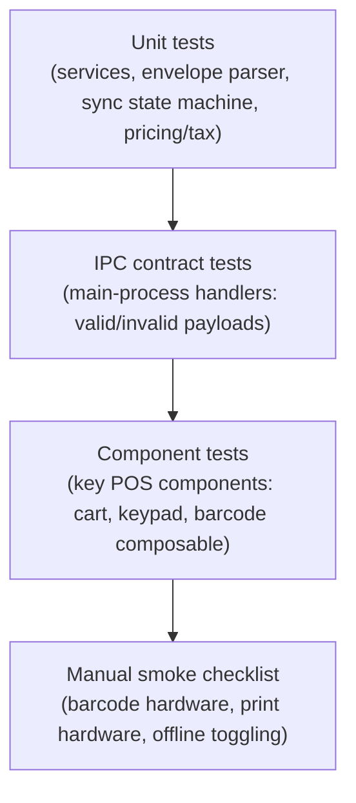

# Testing Strategy

Rules: [.ai/guidelines/testing-and-verification.md](../../.ai/guidelines/testing-and-verification.md).

## Current State (evidence)

`package.json` defines `typecheck` (split node/web via `tsc`/`vue-tsc`) and `lint` (`eslint`), plus
`format` (mutating, not a check) and packaging scripts. **No test script or test runner is
configured.** No test files exist in the repository. This is a tracked gap —
see [../phases/01-foundation-structure.md](../phases/01-foundation-structure.md) and
[../phases/06-hardening-testing-packaging.md](../phases/06-hardening-testing-packaging.md).

## Layers (target, once a runner is added)

Automated layers (unit, IPC, component) run in CI/local via whichever runner is adopted in Phase 1
(decision not yet made in this repo — evaluate against `electron-vite`/Vite compatibility, e.g.
Vitest, when that phase starts). Hardware-dependent behavior (real barcode scanner, real receipt
printer) stays in the manual smoke checklist — it cannot be meaningfully automated without physical
hardware or a fake hardware harness that doesn't currently exist.

## What Must Be Covered Before Considering a Feature Done

| Feature area | Minimum coverage |
|---|---|
| API client | Envelope parsing (success/error/malformed), each documented error `code` |
| IPC handlers | Valid payload accepted, invalid payload rejected before reaching main logic |
| Sync queue | Every state transition in `offline-sync-contract.md`, including quarantine/pause paths |
| Route guards | Unauthenticated, unbound-token, device-mismatch, license-denied redirects |
| Pricing/tax/discount | Core calculation paths in cart/checkout services |

## Manual Smoke Checklist

See [.ai/guidelines/testing-and-verification.md](../../.ai/guidelines/testing-and-verification.md)
for the current checklist; it grows as hardware-dependent features (barcode, printing) land.
