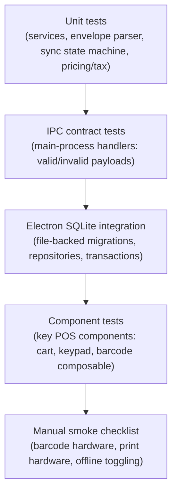

# Testing Strategy

Rules: [.ai/guidelines/testing-and-verification.md](../../.ai/guidelines/testing-and-verification.md).

## Current State (evidence)

`package.json` defines `typecheck` (split node/web via `tsc`/`vue-tsc`), `lint` (`eslint`),
`test`/`test:watch` (Vitest), the Electron-ABI `smoke:database` and `test:sqlite:electron` commands,
plus packaging scripts.
Foundation tests cover envelope parsing, error normalization, route confinement, device identity,
queue policy, IPC serialization, router decisions, and named preload gateways.

## Layers

Automated layers run in CI/local through Vitest except the native SQLite suite. Main/shared tests use
host Node, renderer tests use happy-dom, and `test:sqlite:electron` runs file-backed production
migrations, repositories, and services through Electron's Node runtime. This is deliberate:
`better-sqlite3` is rebuilt for Electron during install, so using Electron preserves the production ABI
without repeatedly rebuilding the native module for incompatible host Node tests. Each integration case
uses a disposable per-test directory under the OS temp directory and never resolves the app user-data
path.
Hardware-dependent behavior (real barcode scanner, real receipt printer) stays in the manual smoke
checklist.

## What Must Be Covered Before Considering a Feature Done

| Feature area         | Minimum coverage                                                                                                 |
| -------------------- | ---------------------------------------------------------------------------------------------------------------- |
| API client           | Envelope parsing (success/error/malformed), each documented error `code`                                         |
| IPC handlers         | Valid payload accepted, invalid payload rejected before reaching main logic                                      |
| Sync queue           | Every state transition in `offline-sync-contract.md`, including conflict/rejection review and worker-pause paths |
| Route guards         | Unauthenticated, unbound-token, device-mismatch, license-denied redirects                                        |
| Pricing/tax/discount | Core calculation paths in cart/checkout services                                                                 |

## Manual Smoke Checklist

See [.ai/guidelines/testing-and-verification.md](../../.ai/guidelines/testing-and-verification.md)
for the current checklist; it grows as hardware-dependent features (barcode, printing) land.
