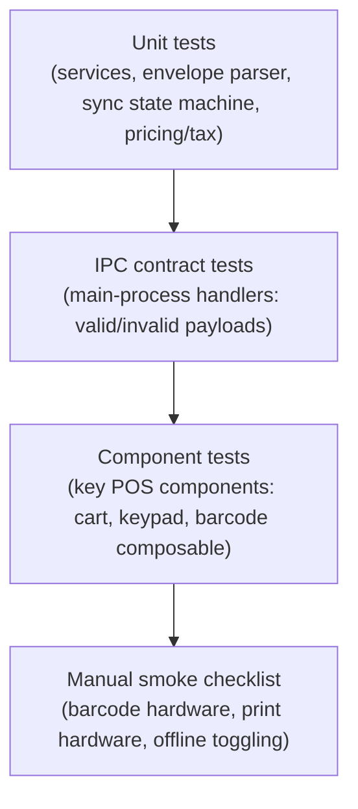

# Testing Strategy

Rules: [.ai/guidelines/testing-and-verification.md](../../.ai/guidelines/testing-and-verification.md).

## Current State (evidence)

`package.json` defines `typecheck` (split node/web via `tsc`/`vue-tsc`), `lint` (`eslint`),
`test`/`test:watch` (Vitest), the Electron-ABI `smoke:database` command, plus packaging scripts.
Foundation tests cover envelope parsing, error normalization, route confinement, device identity,
queue policy, IPC serialization, router decisions, and named preload gateways.

## Layers

Automated layers run in CI/local through Vitest. Main/shared tests use Node, renderer tests use
happy-dom, and the native SQLite boundary is validated only through Electron's Node runtime.
Hardware-dependent behavior (real barcode scanner, real receipt printer) stays in the manual smoke
checklist.

## What Must Be Covered Before Considering a Feature Done

| Feature area | Minimum coverage |
|---|---|
| API client | Envelope parsing (success/error/malformed), each documented error `code` |
| IPC handlers | Valid payload accepted, invalid payload rejected before reaching main logic |
| Sync queue | Every state transition in `offline-sync-contract.md`, including conflict/rejection review and worker-pause paths |
| Route guards | Unauthenticated, unbound-token, device-mismatch, license-denied redirects |
| Pricing/tax/discount | Core calculation paths in cart/checkout services |

## Manual Smoke Checklist

See [.ai/guidelines/testing-and-verification.md](../../.ai/guidelines/testing-and-verification.md)
for the current checklist; it grows as hardware-dependent features (barcode, printing) land.
